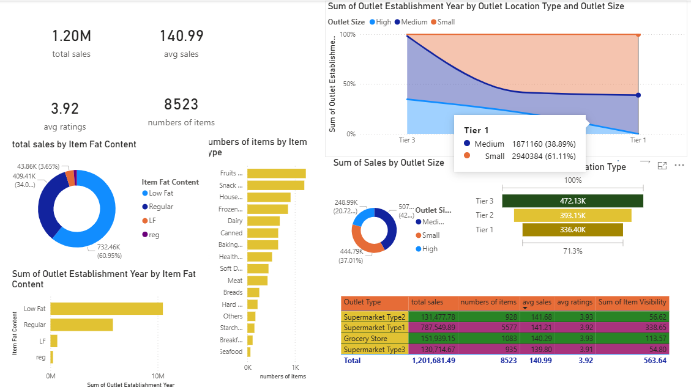

# ⚡ Blink Dashboard for GitHub (Power BI Edition)

A powerful **Power BI dashboard** to visualize and analyze your GitHub data — repositories, commits, issues, and pull requests — with interactive insights and real-time tracking.

---

## ✨ Features

- 📊 **Repository Analytics**
  - Stars, forks, watchers
  - Open vs closed issues
  - Pull request success rate

- 📈 **Commit Insights**
  - Daily/weekly commit trends
  - Contributor activity
  - Peak productivity times

- 🧑‍💻 **User Overview**
  - Contributions summary
  - Top repositories by activity
  - Language usage distribution

- 🔍 **Interactive Filters**
  - Filter by repo, date range, language
  - Drill-through reports

- 🔄 **Auto Refresh**
  - Scheduled data refresh via Power BI Service

---

## 🖼️ Dashboard Preview

###  Overview Page


###  Commit Activity


###  User Insights


###  Repository Breakdown


>  *Tip: Replace the above images with actual screenshots from your Power BI report (`.pbix`) file.*

---

## 🛠️ Tech Stack

- **Visualization Tool:** Power BI Desktop
- **Data Source:** GitHub REST API / GraphQL API
- **Data Transformation:** Power Query (M Language)
- **Modeling:** DAX (Data Analysis Expressions)

---

## 📦 Setup Instructions

### 1️⃣ Prerequisites

- Install **Power BI Desktop**
- GitHub Personal Access Token

---

### 2️⃣ Connect to GitHub API

1. Open Power BI Desktop  
2. Click **Get Data → Web**  
3. Enter API URL:

```bash
https://api.github.com/users/{username}/repos
